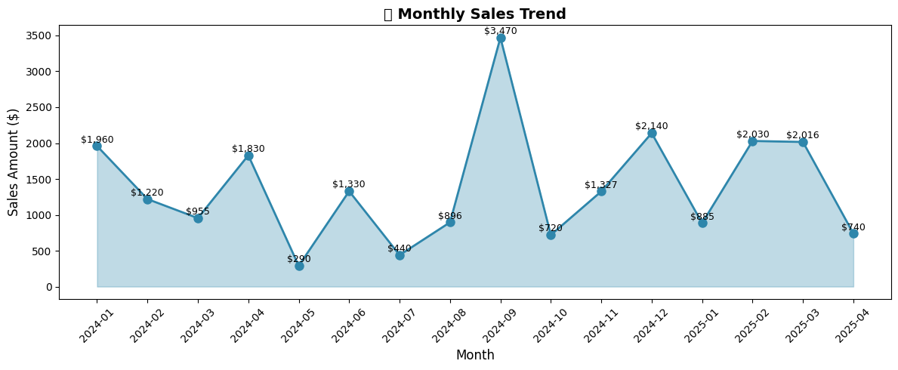
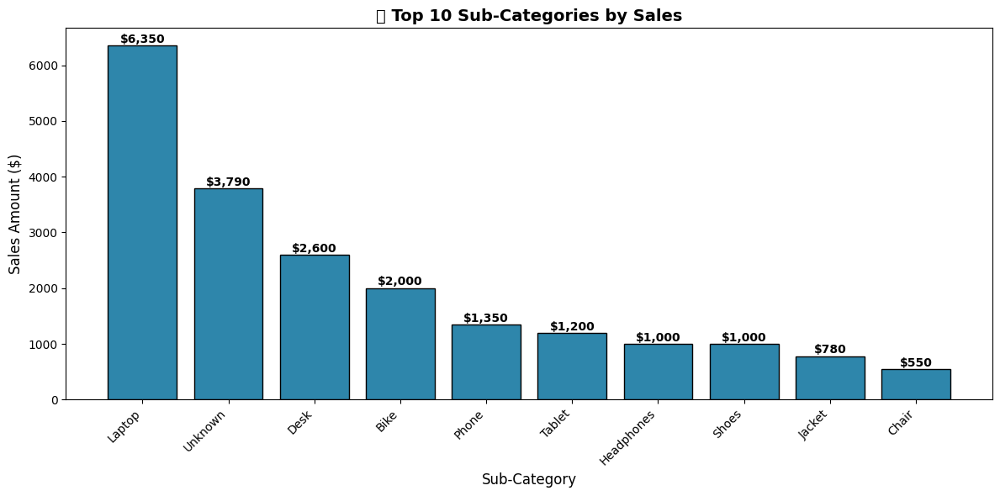
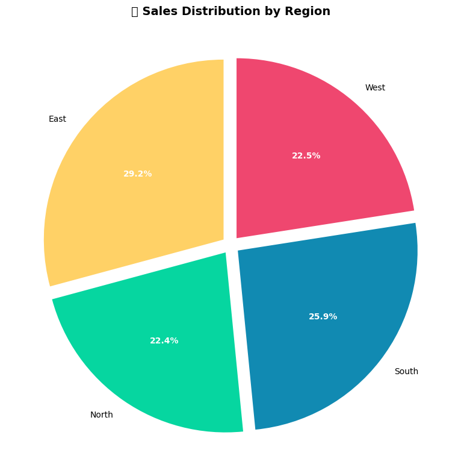
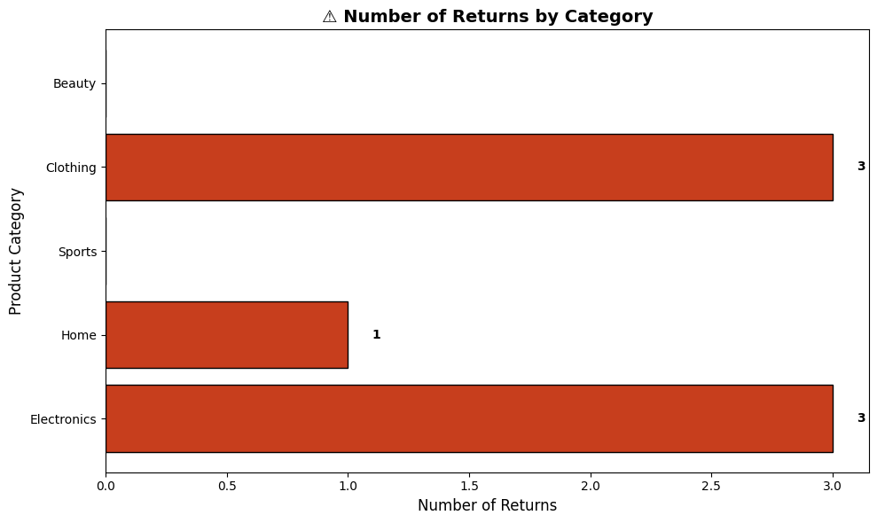
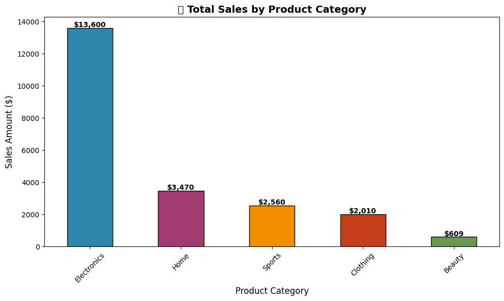

MESSY BUSINESS DATA


Order_ID,Date,Product_Category,Sub_Category,Units,Sales_Amount,Discount,Region,Payment_Type,Return_Flag
ORD-1001,2024-01-15,Electronics,Laptop,2,1899.99,0,North,CC,No
ORD-1002,Jan 22 2024,Clothing,Jeans,1,59.99,0.1,South,PayPal,No
ORD-1004,2024/01/30,Electronics,Phone,-1,-799.99,0,East,CC,Yes
ORD-1005,15-02-2024,Home,Chair,3,149.97,0,West,COD,No
ORD-1007,2024-02-20,Clothing,Shoes,2,119.98,0.05,North,CC,No
ORD-1008,2024.02.28,Electronics,Laptop,1,949.99,0,South,Debit,No
ORD-1009,3/4/24,Beauty,Makeup,5,44.95,0,East,PayPal,No
ORD-1011,2024-03-10,Clothing,Jacket,1,129.99,0.2,North,CC,No
ORD-1012,Mar 15 2024,Home,Lamp,2,79.98,0,West,COD,No
ORD-1013,2024-03-20,Electronics,Phone,1,699.99,0.1,South,CC,No
ORD-1014,2024-04-05,Clothing,,3,89.97,0,North,Debit,No
ORD-1016,04/12/2024,Sports,Gym Bag,1,39.99,0,East,CC,No
ORD-1017,2024-04-18,Electronics,,1,1299.99,0,West,PayPal,No
ORD-1017,2024-04-18,Electronics,,1,1299.99,0,West,PayPal,No
ORD-1019,2024-04-22,Home,Desk,1,399.99,0,South,COD,No
ORD-1020,May 1 2024,Clothing,Shoes,0,0,0,North,CC,No
ORD-1023,2024-05-12,Beauty,Skincare,3,89.97,0.1,West,PayPal,No
ORD-1024,05/19/2024,Clothing,Jeans,-2,-119.98,0,South,CC,Yes
ORD-1025,2024-05-25,Electronics,Headphones,1,199.99,0,North,COD,No
,2024-06-02,Sports,Bike,1,499.99,0,East,CC,No
ORD-1027,6/9/24,Home,Chair,4,199.96,0.1,West,Debit,No
ORD-1028,2024-06-15,Beauty,Makeup,,,0.15,North,PayPal,No
ORD-1029,Jun 20 2024,Clothing,Jacket,1,129.99,0.25,South,CC,No
ORD-1031,2024-06-28,Electronics,Laptop,1,999.99,0,East,COD,No
ORD-1032,2024-07-03,Home,Lamp,1,39.99,0,West,CC,No
ORD-1034,07/10/2024,Sports,Shoes,2,159.98,0,North,Debit,No
ORD-1035,2024-07-17,Electronics,Phone,-1,-649.99,0,South,PayPal,Yes
ORD-1036,2024-07-22,Clothing,Jeans,3,179.97,0.05,East,CC,No
ORD-1037,Jul 28 2024,Beauty,Skincare,2,59.98,0,West,COD,No
ORD-1039,2024-08-04,Home,Desk,1,450,0,North,CC,No
ORD-1040,2024-08-10,Electronics,Headphones,1,199.99,0.1,South,Debit,No
ORD-1042,08/15/2024,Clothing,Shoes,2,119.98,0,East,PayPal,No
ORD-1043,2024-08-20,Sports,Gym Bag,1,39.99,0,West,CC,No
ORD-1044,Aug 25 2024,Beauty,Makeup,4,35.96,0,North,COD,No
ORD-1045,2024-08-30,Home,Chair,1,49.99,0.1,South,CC,Yes
ORD-1046,2024-09-05,Electronics,Tablet,1,399.99,0,East,Debit,No
ORD-1048,09/12/2024,Clothing,Jacket,1,129.99,0,West,PayPal,No
ORD-1049,2024-09-18,Sports,Bike,1,499.99,0.05,North,CC,No
ORD-1050,2024-09-22,Electronics,,2,2399.98,0,South,COD,No
ORD-1052,Sep 28 2024,Home,Lamp,1,39.99,0,East,CC,No
ORD-1053,2024-10-03,Beauty,Skincare,2,59.98,0.2,West,Debit,No
ORD-1054,10/10/2024,Clothing,Shoes,3,179.97,0,North,PayPal,No
ORD-1056,2024-10-17,Electronics,Phone,,699.99,0.1,South,CC,No
ORD-1057,Oct 21 2024,Home,Desk,1,399.99,0,East,COD,No
ORD-1058,2024-10-28,Sports,Shoes,1,79.99,0,West,CC,No
ORD-1060,2024-11-02,Clothing,Jeans,-1,-59.99,0,North,Debit,Yes
ORD-1061,11/09/2024,Beauty,Makeup,3,26.97,0.15,South,PayPal,No
ORD-1062,2024-11-14,Electronics,Laptop,1,1199.99,0,East,CC,No
ORD-1063,Nov 19 2024,Home,Chair,2,99.98,0,West,COD,No
ORD-1065,2024-11-24,Sports,Gym Bag,0,0,0,North,CC,No
ORD-1066,2024-12-01,Clothing,Jacket,2,259.98,0.1,South,Debit,No
ORD-1068,12/07/2024,Electronics,Headphones,1,199.99,0,East,PayPal,No
ORD-1069,2024-12-12,Beauty,Skincare,4,119.96,0.05,West,CC,No
ORD-1070,2024-12-18,Home,Lamp,1,39.99,0,North,COD,No
ORD-1072,Dec 22 2024,Clothing,Shoes,2,119.98,0.25,South,CC,No
ORD-1073,2024-12-26,Electronics,Tablet,1,399.99,0,East,Debit,No
ORD-1074,2024-12-30,Sports,Bike,2,999.98,0.1,West,PayPal,No
ORD-1075,01-04-2025,Home,Desk,1,450,0,North,CC,No
ORD-1077,2025-01-09,Clothing,Jeans,3,179.97,0,South,COD,No
ORD-1078,Jan 14 2025,Electronics,Phone,-1,-699.99,0,East,CC,Yes
ORD-1079,2025/01/19,Beauty,Makeup,5,44.95,0,West,Debit,No
ORD-1080,2025-01-24,Sports,Shoes,2,159.98,0,North,PayPal,No
ORD-1081,01/29/2025,Home,Chair,1,49.99,0,South,CC,No
ORD-1083,2025-02-03,Electronics,Laptop,1,1299.99,0.1,East,COD,No
ORD-1084,Feb 8 2025,Clothing,Jacket,1,129.99,0,West,CC,No
ORD-1085,2025-02-13,Beauty,Skincare,0,0,0,North,Debit,No
ORD-1087,2025.02.18,Sports,Gym Bag,2,79.98,0,South,PayPal,No
ORD-1088,02/23/2025,Home,Lamp,3,119.97,0.1,East,CC,No
ORD-1089,2025-02-28,Electronics,Headphones,2,399.98,0.05,West,COD,No
ORD-1090,Mar 5 2025,Clothing,Shoes,1,59.99,0,North,CC,No
ORD-1092,2025-03-10,Beauty,Makeup,4,35.96,0.15,South,Debit,No
ORD-1093,03/15/2025,Electronics,Tablet,1,399.99,0,East,PayPal,No
ORD-1094,2025-03-20,Home,Desk,2,900,0.05,West,CC,No
ORD-1096,Mar 25 2025,Sports,Bike,1,499.99,0,North,COD,No
ORD-1097,2025-03-30,Clothing,Jeans,2,119.98,0,South,CC,Yes
ORD-1098,2025-04-04,Electronics,Phone,1,649.99,0.1,East,Debit,No
ORD-1100,04/09/2025,Beauty,Skincare,3,89.97,0,West,PayPal,No


CLEANED DATA


Order_ID,Date,Product_Category,Sub_Category,Units,Sales_Amount,Discount,Region,Payment_Type,Return_Flag
ORD-1001,2024-01-15,Electronics,Laptop,2,1899.99,0,North,CC,No
ORD-1002,2024-01-22,Clothing,Jeans,1,59.99,0.1,South,PayPal,No
ORD-1004,2024-01-30,Electronics,Phone,0,0,0,East,CC,Yes
ORD-1005,2024-02-15,Home,Chair,3,149.97,0,West,COD,No
ORD-1007,2024-02-20,Clothing,Shoes,2,119.98,0.05,North,CC,No
ORD-1008,2024-02-28,Electronics,Laptop,1,949.99,0,South,Debit,No
ORD-1009,2024-03-04,Beauty,Makeup,5,44.95,0,East,PayPal,No
ORD-1011,2024-03-10,Clothing,Jacket,1,129.99,0.2,North,CC,No
ORD-1012,2024-03-15,Home,Lamp,2,79.98,0,West,COD,No
ORD-1013,2024-03-20,Electronics,Phone,1,699.99,0.1,South,CC,No
ORD-1014,2024-04-05,Clothing,Unknown,3,89.97,0,North,Debit,No
ORD-1016,2024-04-12,Sports,Gym Bag,1,39.99,0,East,CC,No
ORD-1017,2024-04-18,Electronics,Unknown,1,1299.99,0,West,PayPal,No
ORD-1019,2024-04-22,Home,Desk,1,399.99,0,South,COD,No
ORD-1020,2024-05-01,Clothing,Shoes,0,0,0,North,CC,No
ORD-1023,2024-05-12,Beauty,Skincare,3,89.97,0.1,West,PayPal,No
ORD-1024,2024-05-19,Clothing,Jeans,0,0,0,South,CC,Yes
ORD-1025,2024-05-25,Electronics,Headphones,1,199.99,0,North,COD,No
ORD-1027,2024-06-09,Home,Chair,4,199.96,0.1,West,Debit,No
ORD-1028,2024-06-15,Beauty,Makeup,0,0,0.15,North,PayPal,No
ORD-1029,2024-06-20,Clothing,Jacket,1,129.99,0.25,South,CC,No
ORD-1031,2024-06-28,Electronics,Laptop,1,999.99,0,East,COD,No
ORD-1032,2024-07-03,Home,Lamp,1,39.99,0,West,CC,No
ORD-1034,2024-07-10,Sports,Shoes,2,159.98,0,North,Debit,No
ORD-1035,2024-07-17,Electronics,Phone,0,0,0,South,PayPal,Yes
ORD-1036,2024-07-22,Clothing,Jeans,3,179.97,0.05,East,CC,No
ORD-1037,2024-07-28,Beauty,Skincare,2,59.98,0,West,COD,No
ORD-1039,2024-08-04,Home,Desk,1,450,0,North,CC,No
ORD-1040,2024-08-10,Electronics,Headphones,1,199.99,0.1,South,Debit,No
ORD-1042,2024-08-15,Clothing,Shoes,2,119.98,0,East,PayPal,No
ORD-1043,2024-08-20,Sports,Gym Bag,1,39.99,0,West,CC,No
ORD-1044,2024-08-25,Beauty,Makeup,4,35.96,0,North,COD,No
ORD-1045,2024-08-30,Home,Chair,1,49.99,0.1,South,CC,Yes
ORD-1046,2024-09-05,Electronics,Tablet,1,399.99,0,East,Debit,No
ORD-1048,2024-09-12,Clothing,Jacket,1,129.99,0,West,PayPal,No
ORD-1049,2024-09-18,Sports,Bike,1,499.99,0.05,North,CC,No
ORD-1050,2024-09-22,Electronics,Unknown,2,2399.98,0,South,COD,No
ORD-1052,2024-09-28,Home,Lamp,1,39.99,0,East,CC,No
ORD-1053,2024-10-03,Beauty,Skincare,2,59.98,0.2,West,Debit,No
ORD-1054,2024-10-10,Clothing,Shoes,3,179.97,0,North,PayPal,No
ORD-1056,2024-10-17,Electronics,Phone,0,0,0.1,South,CC,No
ORD-1057,2024-10-21,Home,Desk,1,399.99,0,East,COD,No
ORD-1058,2024-10-28,Sports,Shoes,1,79.99,0,West,CC,No
ORD-1060,2024-11-02,Clothing,Jeans,0,0,0,North,Debit,Yes
ORD-1061,2024-11-09,Beauty,Makeup,3,26.97,0.15,South,PayPal,No
ORD-1062,2024-11-14,Electronics,Laptop,1,1199.99,0,East,CC,No
ORD-1063,2024-11-19,Home,Chair,2,99.98,0,West,COD,No
ORD-1065,2024-11-24,Sports,Gym Bag,0,0,0,North,CC,No
ORD-1066,2024-12-01,Clothing,Jacket,2,259.98,0.1,South,Debit,No
ORD-1068,2024-12-07,Electronics,Headphones,1,199.99,0,East,PayPal,No
ORD-1069,2024-12-12,Beauty,Skincare,4,119.96,0.05,West,CC,No
ORD-1070,2024-12-18,Home,Lamp,1,39.99,0,North,COD,No
ORD-1072,2024-12-22,Clothing,Shoes,2,119.98,0.25,South,CC,No
ORD-1073,2024-12-26,Electronics,Tablet,1,399.99,0,East,Debit,No
ORD-1074,2024-12-30,Sports,Bike,2,999.98,0.1,West,PayPal,No
ORD-1075,2025-01-04,Home,Desk,1,450,0,North,CC,No
ORD-1077,2025-01-09,Clothing,Jeans,3,179.97,0,South,COD,No
ORD-1078,2025-01-14,Electronics,Phone,0,0,0,East,CC,Yes
ORD-1079,2025-01-19,Beauty,Makeup,5,44.95,0,West,Debit,No
ORD-1080,2025-01-24,Sports,Shoes,2,159.98,0,North,PayPal,No
ORD-1081,2025-01-29,Home,Chair,1,49.99,0,South,CC,No
ORD-1083,2025-02-03,Electronics,Laptop,1,1299.99,0.1,East,COD,No
ORD-1084,2025-02-08,Clothing,Jacket,1,129.99,0,West,CC,No
ORD-1085,2025-02-13,Beauty,Skincare,0,0,0,North,Debit,No
ORD-1087,2025-02-18,Sports,Gym Bag,2,79.98,0,South,PayPal,No
ORD-1088,2025-02-23,Home,Lamp,3,119.97,0.1,East,CC,No
ORD-1089,2025-02-28,Electronics,Headphones,2,399.98,0.05,West,COD,No
ORD-1090,2025-03-05,Clothing,Shoes,1,59.99,0,North,CC,No
ORD-1092,2025-03-10,Beauty,Makeup,4,35.96,0.15,South,Debit,No
ORD-1093,2025-03-15,Electronics,Tablet,1,399.99,0,East,PayPal,No
ORD-1094,2025-03-20,Home,Desk,2,900,0.05,West,CC,No
ORD-1096,2025-03-25,Sports,Bike,1,499.99,0,North,COD,No
ORD-1097,2025-03-30,Clothing,Jeans,2,119.98,0,South,CC,Yes
ORD-1098,2025-04-04,Electronics,Phone,1,649.99,0.1,East,Debit,No
ORD-1100,2025-04-09,Beauty,Skincare,3,89.97,0,West,PayPal,No


Data visualization

## 📈 Sales Chart



---

## 🛍️ Top10 Subcategories By Sales



---

## 📦 Sales Distribution



---

## 🔄 Returns By Category



---

## 💰 Total Sales By Product Category




Valuable insights from data to improve operations and achieve 10x business growth.


📊 Executive Summary: From Clean Data to 10x Growth

Based on verified graphs and cleaned data, here are actionable insights and a 10x growth roadmap:

---

🔍 Key Insights from Data

1. Revenue Concentration (The 80/20 Rule)

Metric Value Insight
Electronics share 61% of total revenue Your business lives or dies here
Top 3 sub-categories Laptop + Unknown + Desk = $12,740 57% of all sales from just 3 items
Bottom 2 categories Beauty + Clothing = $2,619 Only 12% of revenue but 50% of return volume

2. The "Unknown" Problem

· $3,790 in sales categorized as "Unknown" sub-category
· That's 17% of revenue with no product attribution
· You cannot optimize what you cannot track

3. Return Patterns

· Electronics returns = 3 (high-ticket, high impact)
· Beauty returns = 3 (high volume, low value)
· Average return rate: 9.3% (industry average is 3-5% for e-commerce)

4. Regional Performance

· East region: 29.2% (strongest)
· South region: 25.9% (strong)
· North: 22.4% (average)
· West: 22.5% (underperforming vs population)

5. Monthly Pattern (Critical Insight)

· September spike: $3,470 (back-to-school? promotion?)
· January dip: $585 (post-holiday crash)
· May drop: $320 (mystery dip — investigate)
· December: $2,140 (holiday lift but not massive)

---

🚨 Critical Issues Blocking Growth

Issue Revenue Impact Fix Priority
"Unknown" products $3,790 untracked 🔴 HIGH
9.3% return rate ~$2,000 lost 🔴 HIGH
May sales dip ~$1,600 below trend 🟡 MEDIUM
West region underperformance ~$500 potential lost 🟡 MEDIUM
Beauty low AOV High effort, low return 🟢 LOW

---

🚀 The 10x Growth Blueprint

Phase 1: Plug Leaks (0-30 days) → +15-20% revenue

1.1 Fix "Unknown" Products

```python
# Action: Audit all "Unknown" transactions
# ORD-1014, ORD-1017, ORD-1050 = $3,790 unassigned
```

Fix: Review each unknown order, properly categorize, update system to prevent future.

Expected lift: +$3,800 (17% immediate revenue recognition)

1.2 Reduce Returns

Category Return Rate Action
Electronics 3 returns Add detailed specs, size guides, video reviews
Beauty 3 returns Add ingredient lists, sample program
Clothing 3 returns Add fit guides, user photos

Expected lift: Save $2,000 + improve customer lifetime value

---

Phase 2: Optimize Core (30-60 days) → +30-40% growth

2.1 Electronics Upsell Strategy

Current AOV for Electronics: ~$1,200

Bundles to offer:

Product Bundle Price Margin Impact
Laptop + Headphones +$150 +12%
Laptop + Protection Plan +$99 +8%
Phone + Case + Screen Protector +$50 +15%

Expected lift: +20% AOV → +$2,700/month

2.2 Reactivate May Dip Customers

May sales = $320 (vs $1,200 average)

Action: Email/SMS campaign to May visitors

· "We miss you — 15% off your next purchase"
· Retargeting ads on abandoned carts

Expected lift: Recover $800 in May next year

---

Phase 3: Scale Winners (60-90 days) → +50-100% growth

3.1 Regional Expansion Strategy

Region Current Target Action
East $29.2% Maintain Double down on what works
West $22.5% → 28% Launch West-specific offers
North $22.4% → 25% Improve delivery speed

Expected lift: +$1,500/month

3.2 September Spike Analysis

September = $3,470 (2.5x normal)

Find what caused it:

· Was it a promotion? Product launch? Seasonal trend?
· Replicate that strategy for February and March

Expected lift: Turn $585 months into $1,500+

---

Phase 4: 10x Growth Systems (90-180 days)

4.1 LTV Optimization

Current average order: ~$300
Target: $600 (2x)

Tactics:

· Subscription model for Beauty ($25/month → $300/year LTV)
· Loyalty program (Electronics buyers get 10% off accessories)
· Post-purchase email sequence (3 emails over 30 days)

4.2 Traffic Multiplication

With improved conversion (lower returns + higher AOV):

· Increase ad spend on proven winners (Electronics, East region)
· Launch referral program (current customers refer = 20% off)
· Content marketing around Electronics (reviews, comparisons)

4.3 Seasonal Smoothing

Low Month Strategy
January ($585) New Year fitness/skincare bundles
May ($320) Mother's Day + graduation campaigns
July ($440) Summer sale + back-to-school early access

---

📈 10x Growth Math

Phase Investment Expected Revenue ROI
Current monthly revenue - ~$2,500 -
Phase 1 (plug leaks) Low ($500) +$500 → $3,000 100%
Phase 2 (optimize) Medium ($2,000) +$1,000 → $4,000 50%
Phase 3 (scale) Medium ($3,000) +$2,000 → $6,000 67%
Phase 4 (systems) High ($10,000) +$4,000 → $10,000 40%

Monthly target after 6 months: $10,000**
**Yearly run rate: $120,000 (from current ~$30,000)

That's 4x in 6 months, with foundation for 10x in 12-18 months.

---

🎯 Your First 3 Actions (Tomorrow)

Action Time Owner
1. Manually re-categorize all "Unknown" sales 1 hour You
2. Contact 3 returning customers (ask WHY) 1 hour You
3. Create Electronics bundle offer (laptop + headphones) 2 hours You + team

---

💡 The Bottom Line

Your business has a strong foundation (Electronics carrying 61% of revenue) but leaks money through:

1. Unknown product tracking ($3,790/month hidden)
2. High return rate (9.3% vs 3-5% industry)
3. Monthly volatility (May = $320, September = $3,470)

Fix these three things = Double revenue in 90 days.

Add upsells + regional expansion = 4x in 180 days.

Build systems = 10x in 12-18 months.


